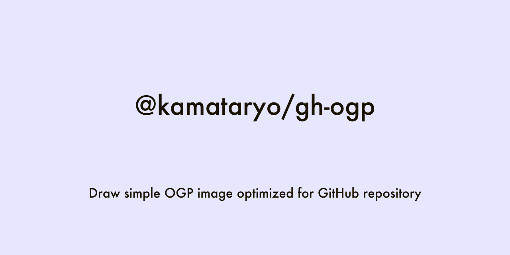
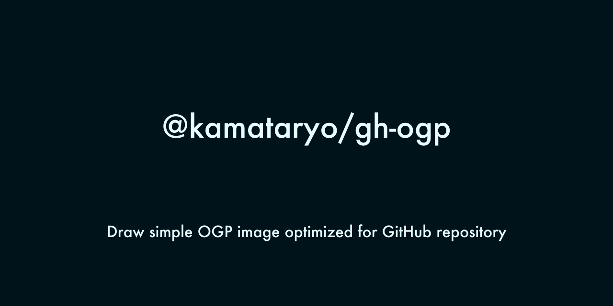

# @kamataryo/gh-ogp

Draw simple OGP image optimized for GitHub repository

# usage

```shell
$ cd path/to/your/Node.js/project
$ npx @kamataryo/gh-ogp dark > dark_image.png
$ npx @kamataryo/gh-ogp light > light_image.png
```

It takes some time to install dependencies when your execute `gh-ogp` at first time.
You can install `gh-ogp` globally.

# development

```shell
$ git clone git@github.com:kamataryo/gh-ogp.git
$ cd gh-ogp
$ yarn
$ ./cli.js dark > test.png
$ ./cli.js light > test.png
```

# Samples



